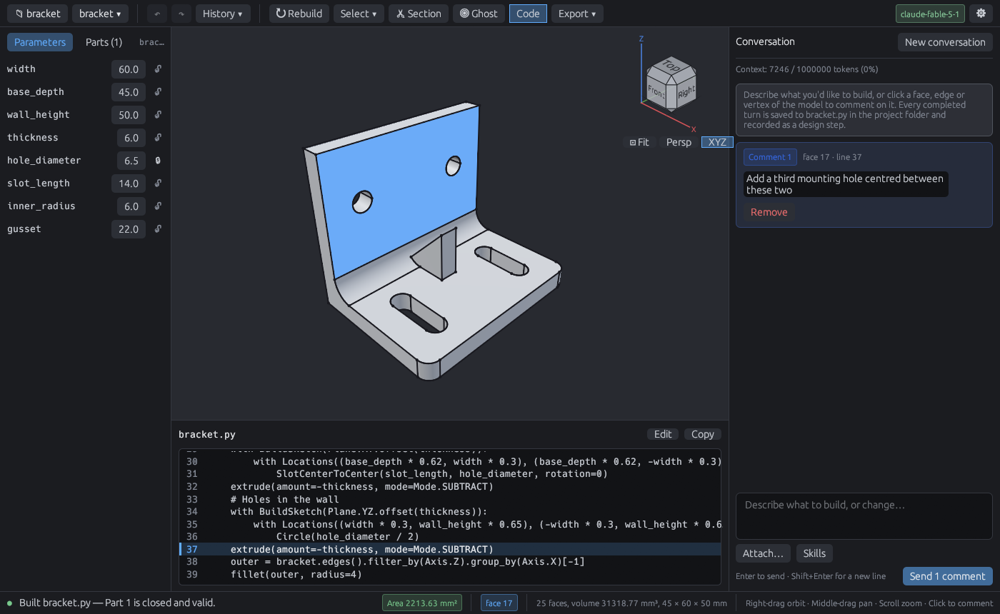

# CADmark

CADmark is a CAD modeller for Linux that you drive by talking to an AI. Click a
face, edge or vertex in the 3D viewport, write what you want changed, and the
AI edits the [build123d](https://github.com/gumyr/build123d) Python script that
defines the part. The script is the source of truth: it lives in an ordinary
folder, and stays readable and editable by hand.



CADmark is early-stage software at version 0.2. There are no packaged
releases yet; you build it from source.

## Features

- **Spatial comments.** Select geometry and anchor a comment to it. The AI
  sees which source line produced the selected element, so "make this wall
  thinner" reaches the right line of code.
- **Parametric by default.** The Parameters panel lists the numbers the script
  names at its top level. Drag a value to change it without an AI turn, or
  lock it so the AI treats it as a hard constraint. Values derived from other
  parameters are shown as their expressions.
- **Design history.** Every accepted edit is a design step you can undo
  (`Ctrl+Z`), and you can name a version to come back to (`Ctrl+S`).
- **Checked exports.** STEP, STL and 3MF exports are read back and compared
  with the model, and a file that does not reproduce the part is refused.
  Sketch-only designs export to SVG and DXF.
- **Printability checks.** After every build the status bar reports whether
  each part is a closed, valid solid. A built-in 3D-printing skill reviews
  designs for filament printing.
- **Images in chat.** Attach, paste or drop photos and drawings for the AI to
  read. Images that define a part are kept in the project's reference library.
- **Bring your own model.** CADmark works with any OpenAI Responses-compatible
  endpoint: OpenAI, a gateway in front of Claude or Gemini, OpenRouter, or a
  local model server.
- **Sandboxed scripts.** AI-written scripts run in a separate worker process
  that can write only to the project folder and its own scratch space, can
  read only those, the Python runtime and the system libraries, and cannot
  open a network connection.

## Requirements

CADmark runs on Linux only. It needs:

- **Linux 5.13 or later with Landlock enabled.** Full filesystem confinement
  needs 6.2 or later. Landlock confines the script sandbox. If the kernel
  cannot enforce it, CADmark refuses to run scripts rather than run them
  unconfined.
- **A Wayland or X11 desktop session** with
  [xdg-desktop-portal](https://flatpak.github.io/xdg-desktop-portal/) for
  file dialogs.
- **A Vulkan-capable GPU**, or Mesa's software Vulkan driver (lavapipe).
- **An API key** for an OpenAI Responses-compatible endpoint, to use the AI.
  Without one, CADmark still opens, rebuilds and exports models.

Continuous integration builds and tests CADmark on a stock Ubuntu 24.04
runner.

## Installing from source

### 1. Install the system packages

You need a C compiler, Git, curl, and the OpenGL libraries that the
modelling kernel loads.

```sh
# Debian / Ubuntu
sudo apt install build-essential git curl libgl1 libegl1

# Fedora
sudo dnf install gcc git curl mesa-libGL mesa-libEGL

# Arch Linux
sudo pacman -S --needed base-devel git curl libglvnd mesa
```

If your machine has no Vulkan GPU driver, also install Mesa's software
renderer: `mesa-vulkan-drivers` on Debian, Ubuntu and Fedora, or
`vulkan-swrast` on Arch.

### 2. Install Rust, uv and just

CADmark builds with a recent stable Rust (edition 2024). Install it with
[rustup](https://rustup.rs):

```sh
curl --proto '=https' --tlsv1.2 -sSf https://sh.rustup.rs | sh
```

The modelling kernel needs **Python 3.12** exactly: its provenance
instrumentation is validated against Python 3.12 with the pinned build123d and
OCP releases, and refuses any other runtime. [uv](https://docs.astral.sh/uv/) is the simplest way
to get it:

```sh
curl -LsSf https://astral.sh/uv/install.sh | sh
uv python install 3.12
```

[just](https://github.com/casey/just) runs the project's recipes
(`cargo install just`, or your distribution's `just` package). It is optional:
each recipe wraps an ordinary `cargo` or `scripts/` command you can run
directly.

### 3. Build and run

```sh
git clone https://github.com/BFJ-Concerns/CADmark.git
cd CADmark
just bootstrap       # create .venv with the pinned build123d and OCP
just run             # build CADmark and open the start view
```

`just bootstrap` runs `scripts/bootstrap-python-runtime`, which finds Python
3.12 through uv, or takes one with `--python /path/to/python3.12`. `just run
path/to/project` opens a project folder directly.

To run the test suite, which is the same one CI runs:

```sh
just test            # or `just verify` to add formatting and lint checks
```

### 4. Install as a desktop application (optional)

```sh
just install
```

This builds a release, copies the binaries and their own Python runtime into
`~/.local/lib/cadmark`, adds a `cadmark` command to `~/.local/bin`, and
registers a menu entry and icon. The installed copy does not depend on the
checkout. Set `CADMARK_PREFIX` to install somewhere else, and run
`just uninstall` to remove it.

## Connecting an AI provider

Open Settings (`Ctrl+,`) and enter the base URL, model name and API key of
your endpoint. Tick "The model reads images" if the model supports vision:
that lets the AI look at renders of the part it is building and read the
images you attach.

The key is stored in an owner-only file beside the settings, never in the
settings file itself. To keep it out of storage altogether, set
`CADMARK_AI_API_KEY` in the environment instead. The
[configuration reference](docs/reference/configuration.md) covers every
setting.

## Using CADmark

A project is a folder, and each part in it is a build123d script. Create or
open a project from the start view, then describe what you want in the chat:

1. Type "a box with rounded edges, 80 mm wide" and press Enter. The AI writes
   a script, runs it, and the part appears in the viewport.
2. Click a face and write a comment such as "put a 6 mm hole through the
   centre of this face". Pending comments are sent together with any chat
   text as one turn.
3. Adjust dimensions in the Parameters panel, inspect the inside with the
   section plane or ghost mode, and export to STEP, STL or 3MF from the
   toolbar.

Start a message with `/3d-printing` to have the AI review the part for
filament printing, or to design with printing constraints in mind.

## Documentation

- [Getting started](docs/guides/getting-started.md): a first session, from
  install to first edit
- [Interface reference](docs/reference/interface.md): viewport, toolbar,
  chat, panels, measurement and shortcuts
- [Configuration reference](docs/reference/configuration.md): settings,
  credentials, script limits and provider errors
- [Designing for 3D printing](docs/guides/3d-printing.md): the built-in
  printing advice, orientation and fit checks
- [Common modelling tasks](docs/guides/modelling.md): threaded bolts, helix
  sweeps, fits, holes, enclosures and fillets

## Reporting problems

Please report bugs and ask questions in
[GitHub issues](https://github.com/BFJ-Concerns/CADmark/issues). For a
build or runtime failure, include your distribution, kernel version
(`uname -r`), desktop session (Wayland or X11) and GPU.

## Licence

Copyright (C) 2026 BFJ Concerns.

CADmark is free software, licensed under the
[GNU Affero General Public License v3.0 or later](LICENSE).

The build123d documentation bundled under `docs/build123d/` is the work of
the build123d contributors and is used under the Apache License 2.0. See
[NOTICE](NOTICE) for details.
