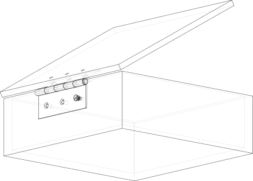
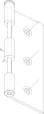
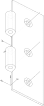
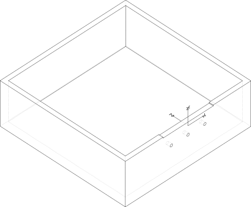
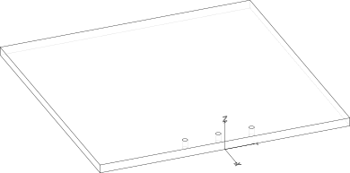
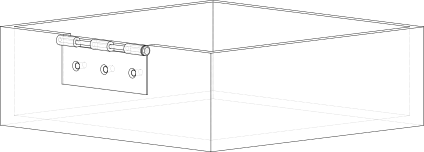
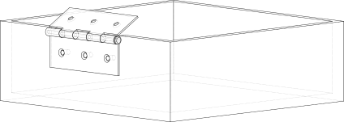
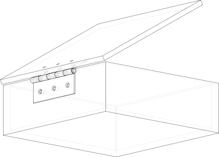

<!-- Source: https://build123d.readthedocs.io/en/latest/tutorial_joints.html -->

# Joint Tutorial

This tutorial provides a step by step guide in using Joints as we create a box with a hinged lid to illustrate the use of three different Joint types.



## Step 1: Setup

Before getting to the CAD operations, this joint script needs to import the build123d environment.

```python
from build123d import *
from ocp_vscode import show, show_object
```

## Step 2: Create Hinge

This example uses a common Butt Hinge to connect the lid to the box base so a `Hinge` class is used to create that can create either of the two hinge leaves. As the focus of this tutorial is the joints and not the CAD operations to create objects, this code is not described in detail.

Once the two leaves have been created they will look as follows:




Note that the XYZ indicators and a circle around the hinge pin indicate joints that are discussed below.

## Step 3: Add Joints to the Hinge Leaf

The hinge includes five joints:

- A `RigidJoint` to attach the leaf
- A `RigidJoint` or `RevoluteJoint` as the hinge Axis
- Three `CylindricalJoint`'s for the countersunk screws

### Step 3a: Leaf Joint

The first joint to add is a `RigidJoint` that is used to fix the hinge leaf to the box or lid.

```python
leaf_builder.add_joint(
    RigidJoint(
        "leaf",
        leaf_builder.part,
        Location((0, 0, 0), (1, 0, 0), 90),
    )
)
```

Each joint has a label which identifies it - here the string "leaf" is used, the `to_part` binds the joint to `leaf_builder.part` (i.e. the part being built), and `joint_location` is specified as middle of the leaf along the edge of the pin. Note that `Location` objects describe both a position and orientation which is why there are two tuples (the orientation listed is rotate about the X axis 90 degrees).

### Step 3b: Hinge Joint

The second joint to add is either a `RigidJoint` (on the inner leaf) or a `RevoluteJoint` (on the outer leaf) that describes the hinge axis.

```python
if is_outer:
    leaf_builder.add_joint(
        RevoluteJoint(
            "hinge_axis",
            leaf_builder.part,
            Location((0, 0, pin_height / 2)),
            axis=Axis.Y,
            min_angle=90,
            max_angle=270,
        )
    )
else:
    leaf_builder.add_joint(
        RigidJoint(
            "hinge_axis",
            leaf_builder.part,
            Location((0, 0, pin_height / 2)),
        )
    )
```

The inner leaf just pivots around the outer leaf and therefore the simple `RigidJoint` is used to define the Location of this pivot. The outer leaf contains the more complex `RevoluteJoint` which defines an axis of rotation and angular limits to that rotation (90 and 270 in this example as the two leaves will interfere with each other outside of this range).

Note that the maximum angle must be greater than the minimum angle and therefore may be greater than 360°. Other types of joints have linear ranges as well as angular ranges.

### Step 3c: Fastener Joints

The third set of joints to add are `CylindricalJoint`'s that describe how the countersunk screws used to attach the leaves move.

```python
with GridLocations(x_spacing=pitch, y_count=3) as gl:
    hole_location = gl.local_locations[0]
    leaf_builder.add_joint(
        CylindricalJoint(
            f"screw_{i}",
            leaf_builder.part,
            hole_location,
            axis=Axis.Z,
            min_translation=0,
            max_translation=10,
            min_angle=0,
            max_angle=360,
        )
    )
```

Much like the `RevoluteJoint`, a `CylindricalJoint` has an Axis of motion but this type of joint allows both movement around and along this axis - exactly as a screw would move.

Here is the Axis is setup such that a position of 0 aligns with the screw being fully set in the hole and positive numbers indicate the distance the head of the screw is above the leaf surface. One could have reversed the direction of the Axis such that negative position values would correspond to a screw now fully in the hole - whatever makes sense to the situation.

The angular range of this joint is set to (0°, 360°) as there is no limit to the angular rotation of the screw.

### Step 3d: Call Super

To finish off, the base class for the Hinge class is initialised:

```python
super().__init__(leaf_builder.part)
```

### Step 3e: Instantiate Hinge Leaves

Now that the Hinge class is complete it can be used to instantiate the two hinge leaves required to attach the box and lid together.

```python
hinge_outer = Hinge(is_outer=True)
hinge_inner = Hinge(is_outer=False)
```

## Step 4: Create the Box

The box is created with `BuildPart` as a simple object - as shown below - let's focus on the joint used to attach the outer hinge leaf.



```python
with BuildPart() as box:
    Box(length=100, width=80, height=50)
    box.add_joint(
        RigidJoint(
            "hinge_attachment",
            box.part,
            Location((0, 40, 50)),
        )
    )
```

Since the hinge will be fixed to the box another `RigidJoint` is used mark where the hinge will go. Note that the orientation of this `Joint` will control how the hinge leaf is attached and is independent of the orientation of the hinge as it was constructed.

### Step 4a: Relocate Box

Note that the position and orientation of the box's joints are given as a global `Location` when created but will be translated to a relative `Location` internally to allow the `Joint` to "move" with the parent object. This allows users the freedom to relocate objects without having to recreate or modify `Joint`'s.

Here is the box is moved upwards to show this property:

```python
box.part.move(Location((0, 0, 20)))
```

## Step 5: Create the Lid

Much like the box, the lid is created in a `BuildPart` context and is assigned a `RigidJoint`.



```python
with BuildPart() as lid:
    Box(length=100, width=80, height=10)
    lid.add_joint(
        RigidJoint(
            "hinge_attachment",
            lid.part,
            Location((0, 40, 10)),
        )
    )
```

Again, the original orientation of the lid and hinge inner leaf are not important, when the joints are connected together the parts will move into the correct position.

## Step 6: Import a Screw and bind a Joint to it

Joints can be bound to simple objects like a `Compound` imported - in this case a screw.


```python
screw = Compound.load_step("M6-1x12-countersunk-screw.step")
screw_joint = RigidJoint(
    "screw_attachment",
    screw,
    Location((0, 0, 5)),
)
```

Here a simple `RigidJoint` is bound to the top of the screw head such that it can be connected to the hinge's `CylindricalJoint`.

## Step 7: Connect the Joints together

This last step is the most interesting. Now that all of the joints have been defined and bound to their parent objects, they can be connected together.

### Step 7a: Hinge to Box

To start, the outer hinge leaf will be connected to the box, as follows:

```python
hinge_outer.joints["leaf"].connect_to(box.joints["hinge_attachment"])
```

Here the `leaf` joint of `hinge_outer` is connected to the `hinge_attachment` joint of `box`. Note that the hinge leaf is the object to move. Once this line is executed, we get the following:



### Step 7b: Hinge to Hinge

Next, the hinge inner leaf is connected to the hinge outer leaf which is attached to the box.

```python
hinge_inner.joints["hinge_axis"].connect_to(
    hinge_outer.joints["hinge_axis"],
    angle=120,
)
```

As `hinge_outer.joints["hinge_axis"]` is a `RevoluteJoint` there is an `angle` parameter that can be set (angles default to the minimum range value) - here to 120°.

This is what that looks like:



### Step 7c: Lid to Hinge

Now the `lid` is connected to the `hinge_inner`:

```python
lid.joints["hinge_attachment"].connect_to(
    hinge_inner.joints["leaf"],
)
```

Which results in:



Note how the lid is now in an open position. To close the lid just change the `angle` parameter to 90°.

### Step 7d: Screw to Hinge

The last step in this example is to place a screw in one of the hinges:

```python
screw_joint.connect_to(
    hinge_outer.joints["screw_0"],
    position=2,
    angle=45,
)
```

As the position is a positive number the screw is still proud of the hinge face as shown here:


Try changing these position and angle values to "tighten" the screw.

## Conclusion

Use a `Joint` to locate two objects relative to each other with some degree of motion.
Keep in mind that when using the `connect_to` method, `self` is always fixed and `other` will move to the appropriate `Location`.

### Displaying Joint Symbols

The joint symbols can be displayed as follows (your viewer may use `show` instead of `show_object`):

```python
show_object(box.joints["hinge_attachment"].symbol, name="box attachment point")
```

or

```python
show_object(m6_joint.symbol, name="m6 screw symbol")
```

or, with the ocp_vscode viewer

```python
show(box, render_joints=True)
```
